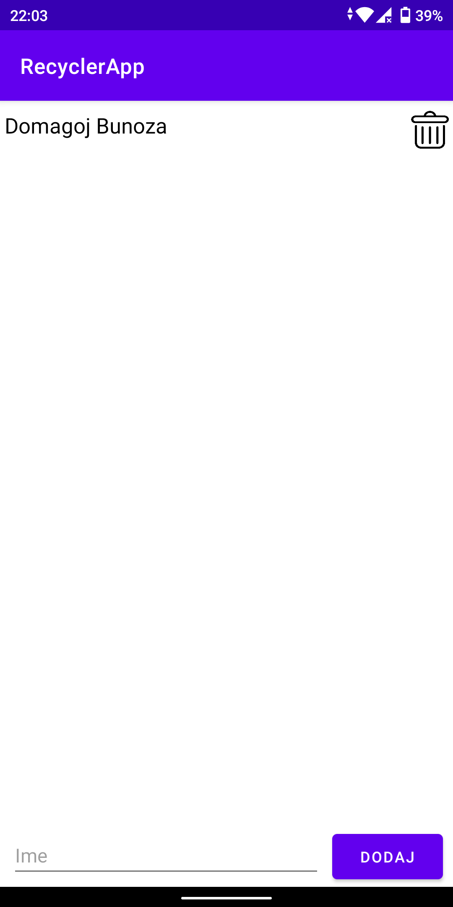
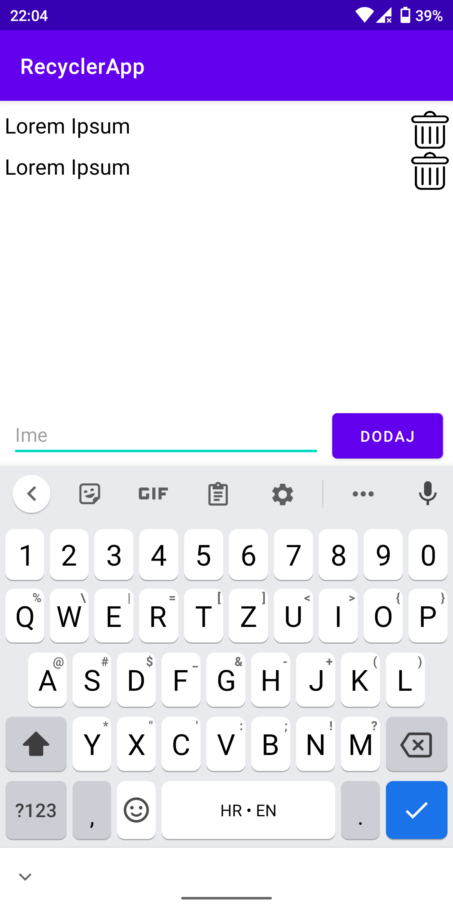

# RecyclerApp
* Android application made for ORWMA - LV6
* Android aplikacija napravljena za ORWMA - LV6
### Dodaci:
* Automatska velika početna slova riječi u EditTextu
* Prilikom pokušaja dodavanja praznog polja kao imena pokazuje se toast s odgovarajućim natpisom
* Pritiskom na dodano ime, pomoću toast-a ispisuje je pozicija pritisnutog imena
* Prilikom pritiska na gumb "DODAJ" sadržaj EditTexta se briše 

Testirano na uređajima: Xiaomi Mi A2 (physical device) i Pixel 3a (emulated device).

Ikona (foreground i background):

     

Ikona korištena za gumb za brisanje elementa Recyclerviewa:

Screenshot:

              
